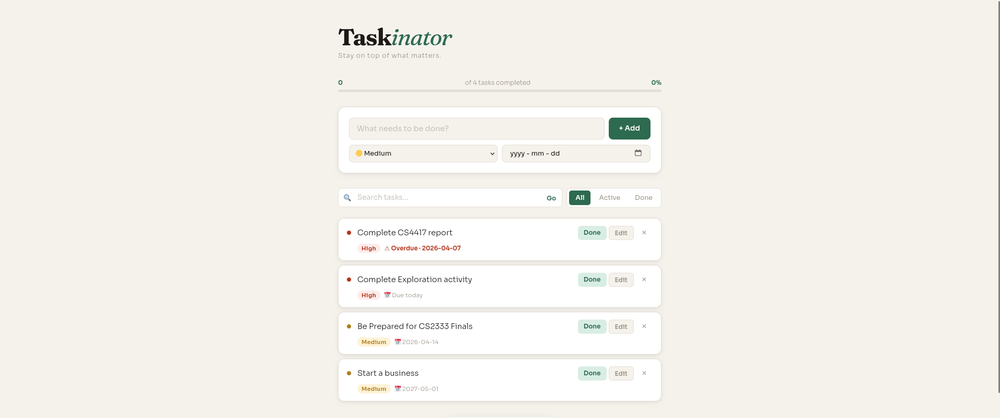
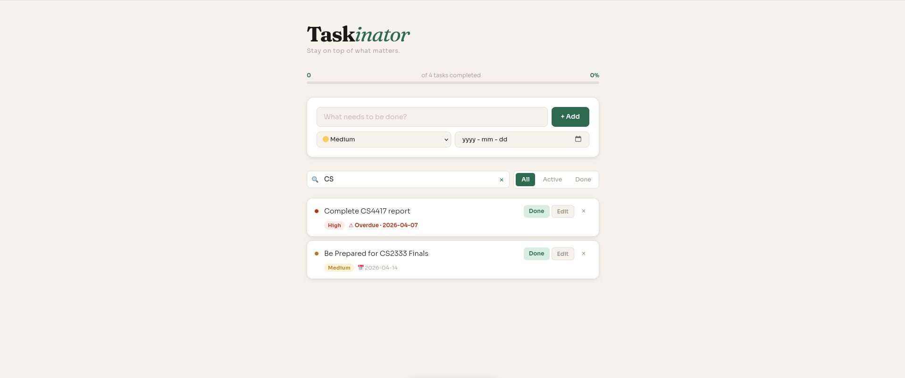
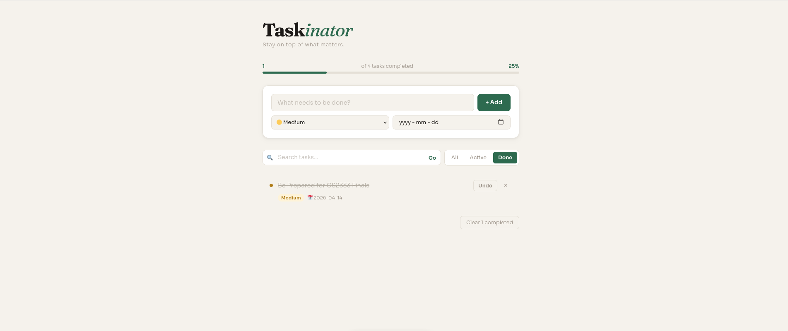
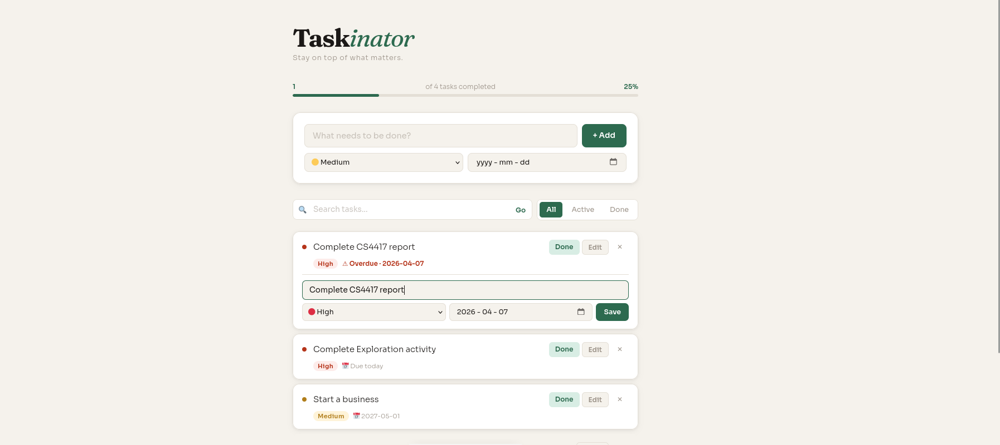

# Taskinator — Flask To-Do App

## 1. Which package/library does this program demonstrate?

This program uses **Flask**, a lightweight web framework for Python. It also uses Python's built-in **sqlite3** module for persistent task storage, and Python's **datetime** module to handle due date comparisons.

---

## 2. How do you run the program?

**Requirements:**
- Python 3 installed
- Flask installed

```bash
pip install flask
```

**Steps:**

```bash
# Navigate into the project folder
cd explorationActivity

# Run the app
python3 app.py
```

Then open your browser and go to: `http://127.0.0.1:5000`

The database (`tasks.db`) is created automatically on first run. If you are re-running the app after changes to the database structure, delete it first:

```bash
rm -f tasks.db
```

---

## 3. What purpose does the program serve?

Taskinator is a personal task manager built with Flask. It goes beyond a basic to-do list by letting you set priority levels, due dates, and search/filter your tasks.

| Feature | Description |
|---|---|
| Add tasks | Enter a title, choose a priority level, and optionally set a due date |
| Mark done / undo | Toggle tasks between active and completed |
| Edit tasks | Update the title, priority, or due date inline without leaving the page |
| Delete tasks | Remove individual tasks |
| Search | Filter tasks by keyword in real time |
| Filter by status | View all, active only, or completed tasks |
| Overdue detection | Tasks past their due date are flagged with a warning |
| Progress bar | Tracks how many tasks are completed out of total |
| Clear completed | Remove all done tasks in one click |

All data is saved in a local SQLite database, so tasks persist between sessions.

---

## 4. Sample Input / Output

**Main view — tasks with priority levels, due dates, and overdue warning:**



**Search — typing "CS" filters matching tasks in real time:**



**Done tab — completed tasks shown with strikethrough and progress bar updated:**



**Inline edit — clicking Edit expands a form to update the task without leaving the page:**


